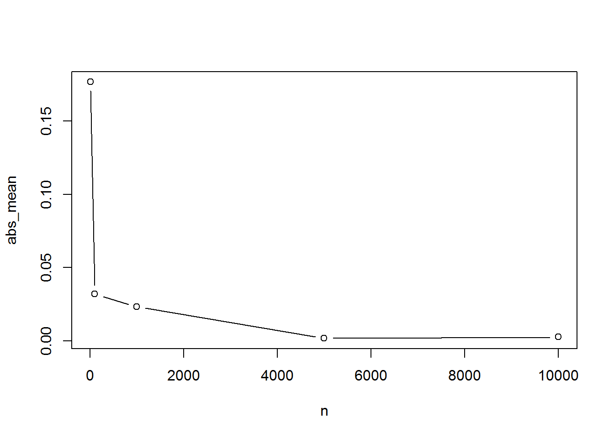

```{r setup, include=FALSE}
knitr::opts_chunk$set(echo = FALSE)
```

R 語言與資料科學導論作業 (W3)
=============================

一般系 b96001001 未命名


## A. Make Some Noise

### 製造錯誤訊息
請找出至少五個不同「*類型*」的錯誤訊息。例如課堂上看到的：
```{r error0.1, echo=TRUE, error=TRUE}
help!!!
```

和

```{r error0.2, echo=TRUE, error=TRUE}
help me!!!
```

這兩個的錯誤訊息都是`Unexpected symbol(or '!')`，所以只算一種。
請完成以下的幾個code blocks。每一個都要有不同類型的錯誤。
如果你玩得欲罷不能，歡迎自行增加code blocks，記得在chunk option中要加上`error=TRUE`，不然RMarkdown會很貼心地停在錯誤的地方。

提示：  

* 課堂上已經提到的東西有license(), contributors(), help(), 
  以及一個還沒有成功的plot()，把他們排列組合，R會有意想不到的回應。

```{r error1, echo=TRUE, error=TRUE}
# Make a mistake here
```

```{r error2, echo=TRUE, error=TRUE}
# Make a mistake here
```

```{r error3, echo=TRUE, error=TRUE}
# Make a mistake here
```

```{r error4, echo=TRUE, error=TRUE}
# Make a mistake here
```

```{r error5, echo=TRUE, error=TRUE}
# Make a mistake here
```

## B. Help yourself out

### 簡單統計函數
現在的確還沒有講到函數、資料輸入等，但你已經知道怎麼在R裡求助。請在help的幫助下完成以下問題：


1. 我有一筆資料：
```
1,2,3,4,5,6,7,8,9,10
```
在R裡面要怎麼表達這一個包含10個數字的序列？
它的輸出結果應該要長得像這樣：
```
[1]  1  2  3  4  5  6  7  8  9 10
```
```{r data.entry, echo=TRUE}
# your code goes here
```

2. 請用length, sum, mean, sd分別計算出這筆資料的個數、總和、平均以及標準差。  
* 請不要用梯形公式((1+10)*10/2)或直接加總(1+2+3+...)。

```{r simple.stat, echo=TRUE}
# Put your code here, there should be at least four lines.
# number of element

# summation

# mean

# standard deviation

```

## 進階選答題

### Problem A.

請讓R丟出一個包含"You are not seeing what I am seeing"的錯誤訊息。
提示：

* 錯誤訊息不是「內建」的，它也是某個人寫的東西。所以你也可以寫自己的錯誤訊息。
* 你可以搜尋怎麼在R裡面怎麼丟錯誤訊息。

```{r error.custom, echo=TRUE, error=TRUE}
# Make a mistake here
```

### Problem B.

rnorm是一個在常態分配下的亂數產生器，rnorm(n, 0, 1)可以在標準常態分配下隨機抽取n個數值 。請用這個函數抽出n個數值後，計算出這些數值的平均數，並取絕對值。這個方法要重複5次，這5次的n分別是10, 100, 500, 1000, 5000。 最後請對這5個點做圖，這張圖的橫軸是n，縱軸是平均數絕對值。

提示：  

* 這個與現在談到的東西遠一點，但你首先可以找看看怎麼用plot，然後怎麼取絕對值。
* 你可能會需要用到迴圈或其他函數簡化程式碼，但直接一行行列出來也是可接受的。
* 最後產生出來的圖可能長得像這樣，（圖形類別僅供參考，數值也不會一樣）

```{r samples, echo=TRUE}
# your code goes here
```
