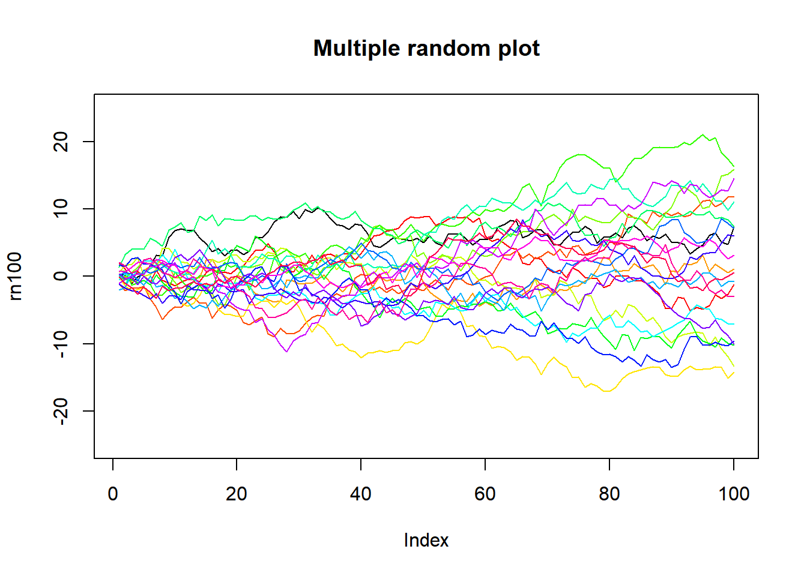

```{r setup, include=FALSE}
knitr::opts_chunk$set(echo = FALSE)
```

R 語言與資料科學導論作業 (W4)
=============================

一般系 b96001001 未命名


## A. Complete compute_area(...) (70%)

### 撰寫compute_area函數
請完成課堂上的compute_area(...)，它必須能夠：

* 計算二種形狀的面積和周長：
    * 圓形（以半徑長當參數）
    * 正方形（以邊長當參數）

函數的型態(signature)：

* 輸入為兩個參數：
    * x: 邊長或半徑
    * shape_str: "circle" 或是 "square"
* 函數回傳：
    * 一個vector。該vector有兩個元素。第一個是面積，第二個是周長。請記得給它恰當的名稱。


```{r func_def, echo=TRUE}
# your function definition goes here
```

假設你的函數名稱也是compute_area，且參數順序是邊長（半徑）和形狀，那以下的結果應該要是一樣的。

```r
circ_ret <- compute_area(6.5, "circle")
##   circle_area circle_circum 
##      132.7323       40.8407
```

```r
sqr_ret <- compute_area(5.2, "square")
##   square_area square_circum 
##         27.04         20.80
```

#### 評分標準：
* 定義compute_area函數(10%)
* compute_area函數可接受兩個參數(10%)
* 當形狀參數為"circle"時，可正確計算其面積(10%)和邊長(10%)。
* 當形狀參數為"square"時，可正確計算其面積(10%)和邊長(10%)。
* 回傳的vector有恰當名稱，標明其值為面積或邊長(10%)。


## B. Plot the future  (30%)

### 繪圖函數
R內建很豐富的繪圖指令，例如繪製散佈圖、折線圖的plot
和直方圖的hist。請用說明文件幫助你找到正確的方式畫出散佈圖、折線圖和直方圖。

繪圖用的資料可以用以下code chunk直接產生。請注意，由於是資料是隨機產生的，
每次執行的資料都會是不同的。

您需要用以下的plot_data完成3張圖：

1. x 和 y 的散佈圖(10%)
2. x 和 z 的折線圖(10%)
3. y 的直方圖(10%)

您只需要繪製出圖本身即可。但當然歡迎幫它加上標題、顏色、軸標題等等。

```{r data.prep, echo=TRUE}
plot_data = data.frame(
    x <- 1:100,
    y <- 50 + 10 * rnorm(length(x), 0, 1),
    z <- x * 0.8 + rnorm(length(x), 0, 4)
)
```

```{r scatter.code, echo=TRUE}
# scatter plot
# your code goes here
```

```{r line.code, echo=TRUE}
# line chart
# your code goes here
```

```{r hist.code, echo=TRUE}
# histogram
# your code goes here
```

## 進階選答題

### Problem A (10%)

這一題我們會用到R的內建資料集，CO2，你可以用`help(CO2)`查詢該資料內的變項和說明。
我們現在想要整理這筆資料，計算Treatment和Type兩變項下各四個情境的uptake平均數。
您可以先用head, plot, unique,
table等函數看看資料內容，然後用課堂上講到的for迴圈、mean函數來整理資料。
或者，您也可以不用for迴圈，用R的內建指令或其他套件來完成這個分析。

您分析完成的結果，可能會類似這樣：

```
   Treatment        Type   uptake
1 nonchilled      Quebec  <value>
2    chilled      Quebec  <value>
3 nonchilled Mississippi  <value>
4    chilled Mississippi  <value>
```

#### 評分標準：  

* 將資料整理成如上述形式。

```{r data.agg, echo=TRUE}
# your code goes here
```

### Problem B (10%)

以下有一個資料產生函數`rn100()`，每呼叫一次它都會產生出100個數值。
請重複呼叫他20次，並把這20次的結果分別以不同顏色，繪製成折線圖，並呈現在同一張圖上。

繪出的圖應該會有20條折線，x軸就是1到100，y軸就是函數產生的數值，圖上應該有20條顏色不同的線。
您畫出的圖形應該會很像這個樣子，但由於rn100是隨機函數，所以結果不會完全相同，您也不需使用相同的顏色。


#### 評分標準：  

* 將20條線畫在同一張圖中(5%)。
* 每條線有不同的顏色(5%)。

```{r rn100, echo=TRUE}
rn100 <- function() cumsum(rnorm(100, 0, 1))
```

```{r multi.plot, echo=TRUE}
# your code goes here
```