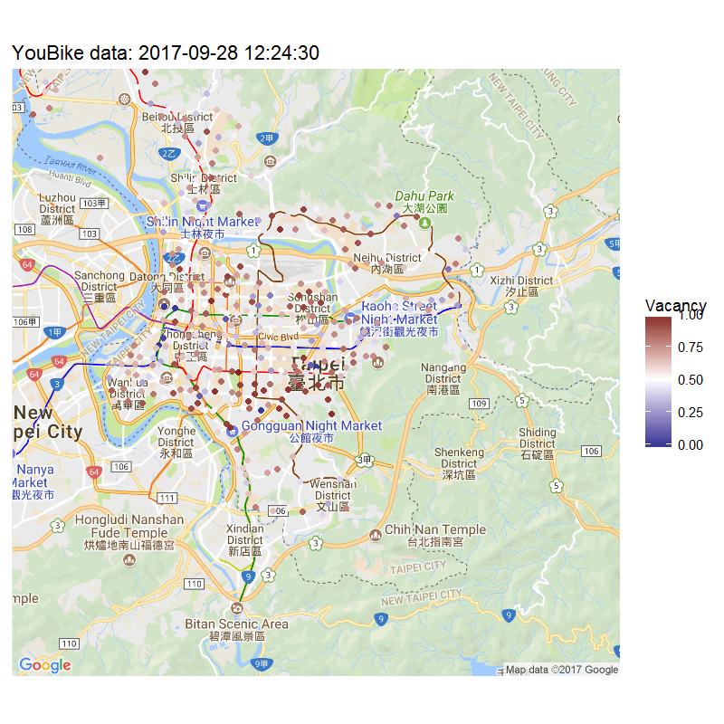

```{r setup, include=FALSE}
knitr::opts_chunk$set(echo = FALSE)
```

R 語言與資料科學導論作業 (W5)
=============================

一般系 b96001001 未命名

## Data Analysis

### 請使用R的內建資料`esoph`當作練習用的資料。

#### 一、請先瞭解一下這個資料的內容（`help(esoph)`）。

* 請列出這筆資料的簡單描述統計。如果該筆變項是類別變項，請描述其次數分配；若該筆變項是連續變項，請至少呈現中數和平均數。
* 請找出這個資料集共有幾列資料。

```{r data.descrip, echo=TRUE}
# your code goes here
```

#### 二、資料作圖

* 請對此資料集做一張圖，任何圖（散佈圖、直方圖、或課堂上看到的矩陣散佈圖）都可以。

```{r data.plot, echo=TRUE}
# your code goes here
```

#### 三、請做出一個各年齡組的摘要表。

* 這張摘要表應有6列，每列分別是一個年齡組。每列資料除了有年齡組(agegp)這個分組變項外，還需有sum_ncases變項，代表在各年齡組中，所有ncases的總和；以及sum_ncontrols，代表在各年齡組中，所有ncontrols的總和。


```{r data.age.grp, echo=TRUE}
# your code goes here
```

#### 四、不同酒精使用程度的摘要表。

* 假設現在僅關心是25-34和45-54兩個年齡組，他們在不同酒精使用程度中的個案數和控制組數。
* 這張表格應該有8列，並且共有4個變項：前兩個變項是年齡組與酒精使用程度。後兩個變項是所有在該年齡組和酒精使用程度中，其個案數和控制組數的總和。

```{r data.alc.grp, echo=TRUE}
# your code goes here
```


## 進階選答題

[台北YouBike 開放資料](https://goo.gl/KLxuhf)是一個很常在資料科學專案應用或教學的例子。這個資料就在我們身邊，我們都接觸過他，甚至才剛剛貢獻過一點資料。這個作業請你試著接觸YouBike資料，看看裡面有什麼訊息。

### A. 把YouBike資料轉為data.frame
請你先到[台北YouBike 開放資料](https://goo.gl/KLxuhf)看一下資料描述。其中提到現在的介接網址是<http://data.taipei/youbike>。你可以直接在R裡面把這個檔案下載下來；或者手動把它下載下來後，把JSON格式換成R的data.frame。

```{r bike.data, echo=TRUE}
# your code goes here.
# please display the data with head() in the last line
```

### B. 請按照台北各個行政區分組，計算每個行政區內，YouBike站點的平均停車格數、目前車輛數、以及空位數。並且按照空位數（從小到大）排序。

```{r bike-by-area, echo=TRUE}
# your code goes here
```

### C. 請篩選出空位率最高的5％站點，並且按照他們的空位率（從大到小）排序。

```{r bike-top, echo=TRUE}
# your code goes here
```


### D. 請把站點的位置畫在一張地圖上，並且同時呈現每個站點的空位率（或可使用率）。

```{r bike-map, echo=TRUE}
# your code goes here
```

### 提示：

* 轉資料可能是最瑣碎的一步。你需要知道什麼是JSON檔，R要怎麼處理JSON，以及JSON檔要怎麼變成data.frame。有了data.frame後，剩下的步驟就是一般的處理程序
* R要呈現地圖訊息相當簡單；你只要找對package，這裡的作圖就只是把經緯度，和我們感興趣的資料畫散佈圖。
* 最後成品可能會長得像這樣（僅供參考，你的成品不需要一模一樣）。


