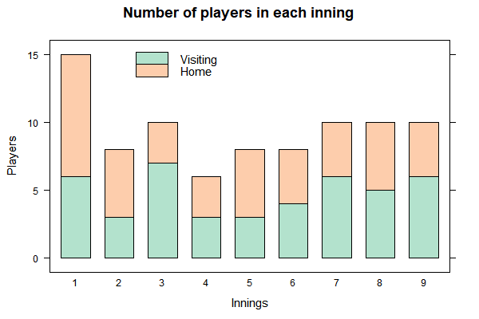

```{r env.setup, echo=TRUE, message=FALSE}
# environment setup
```

R 語言與資料科學導論作業 (W6)
=============================

一般系 b96001001 未命名

## Volatile Text (45%)

### CBOE Volatility Data

請到以下連結下載CBOE的[VIX Futures Settlements資料](https://goo.gl/Yb5UEJ)
（資料來源：[Link](http://cfe.cboe.com/market-data/settlement/volatility-settlements)）。
這筆資料是個單純的文字檔，內容全部是英數文字。裡面有每週Settlement數值，請把這些資料變成一個data frame。接著，請以日期當橫軸，數值當縱軸做折線圖。


### 一、請將資料轉變為data frame。 (35%)
data frame應該有兩欄。第一欄是日期，第二欄是數值。第一筆數值的日期應該是10/11/2017，最後一筆則是8/5/2015。

#### 評分標準：

* 成功地將文字檔中的日期與數值資料擷取出來 (20%)
* 將資料格式化為data frame (10%)
* 資料按照日期（從最近到最舊）排序(5%)

```
         date settle
       <dttm>  <dbl>
 1 2017-10-11   9.96
 2 2017-10-04   9.61
 3 2017-09-27   9.83
 ...
```

```{r vix.settle, echo=TRUE}
# your code goes here.
```

### 二、請將該資料作折線圖。(10%)

#### 評分標準：

* 資料繪製成折線圖(10%)

```{r vix.graph, echo=TRUE}
# your code goes here.
```

## Collect the Runes (50%)

### 計算論語字頻表

請用以下連結下載[論語全文](https://raw.githubusercontent.com/RLadsNTU/RLadsLab/master/W6_TextTextText/data/confucius.txt)。這個檔案已經是個純文字檔，並用UTF-8編碼，所有標點符號都已經去除，但仍然有分行。
請您找出這個論語檔案中總共有幾個字，並有幾個不同的字，以及每個字的字頻。


```
# A tibble: 1,361 x 2
   character frequency
       <chr>     <int>
 1        子       979
 2        曰       757
 3        之       611
 ...
```

### 一、製作字頻表 (35%)

#### 評分標準：

* 計算字頻 (10%)
* 將資料格式化為data frame (5%)

```{r char.runes, echo=TRUE}
# your code goes here.

```


### 二、字頻表作圖 (15%)

#### 評分標準：

* 資料繪製成圖形(15%)

```{r runes.plot, echo=TRUE}
# your code goes here.

```


## 進階選答題 (20%)

請用以下連結下載某一場中華職棒的比賽[文字記錄](https://goo.gl/XKrhxc)。裡面的內容分別是每一個半局每個打擊者的記錄。
當然，有很多細微的情境和動力很難從幾千個字中看出來，
但這個文字訊息裡，我們還是可以看到每個半局，有幾個打者上場打擊，
什麼時候有人出局，什麼時候有人上壘，什麼時候得分等等。
在這個練習中，請試著把每個半局，總共有幾棒打者上場的訊息擷取出來。
並把它整理成一個data.frame，最後請把這筆資料如以下方法視覺化的呈現出來。



#### 評分標準：

* 資料剖析(10%)
* 資料視覺化(10%)

```
   inning halves  nBat
    <dbl>  <dbl> <dbl>
 1      1      1     6
 2      1      2     9
 3      2      1     3
 4      2      2     5
...
```

```{r play.vis, echo=TRUE, dpi=300, fig.height=7, fig.height=7}
# your code goes here.
```

```{r}
## charting
```

