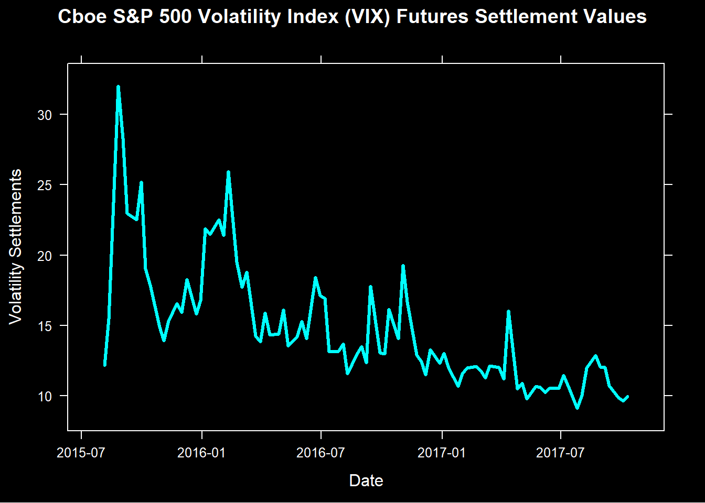
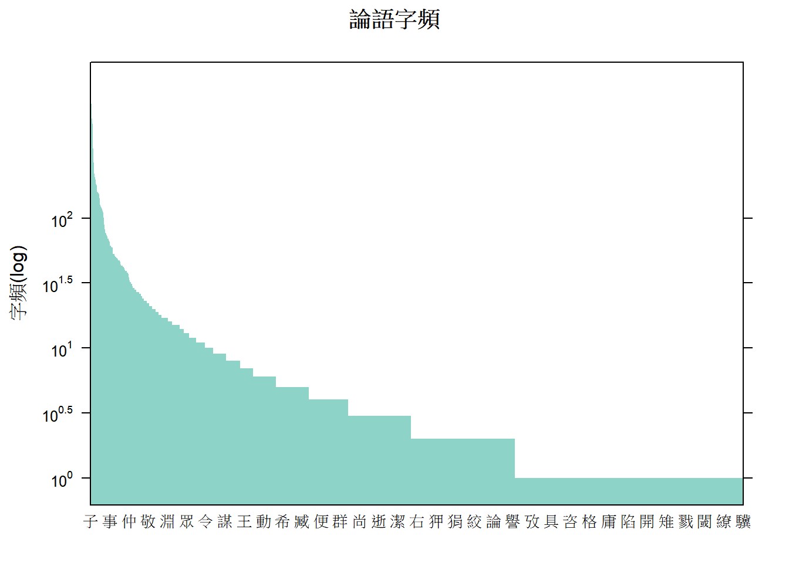

```{r env.setup, echo=TRUE, message=FALSE}
# environment setup
```

R 語言與資料科學導論作業 (W6)
=============================

一般系 b96001001 未命名

## Volatile Text (45%)

### CBOE Volatility Data

CFE（CBOE Futures Exchange）網站上有一個網頁記錄了VIX期貨的每週結算價。
當然，該資料也有csv格式，但這個[網頁](http://cfe.cboe.com/market-data/settlement/volatility-settlements)
直接用文字方法記錄每週的結算價格，非常適合拿來當文字資料的剖析練習。

請到以下連結下載CFE的[VIX Futures Settlements資料](https://goo.gl/Yb5UEJ)。
這個檔案已經整理成一個單純的純文字檔，內容全部是英數文字。
檔案內容有每月結算價格，以及每週結算價格。
在這個練習裡，要請您把每週結算價格這些資料變成一個data frame。
這個data frame有兩個欄位，一個是日期(date)、一個是結算價(settle)。
轉變為data frame後，請以日期當橫軸，數值當縱軸做折線圖。

### 一、將資料轉變為data frame。 (35%)
您可以參考以下提示：

1. 讀取文字檔的方法可以透過內建函數或套件。您可以參考`readr`裡面的`read_file`函數，它可以把整個檔案內容讀成一個字串。
2. 文字檔內包含很多訊息，有Monthly Settlement Values和Weekly Settlement Values。我們只需要Weekly Settlements。
3. 在文字內容中，所有我們需要的每週結算價格都遵循著固定格式，亦即<英文月份>(<月/日/年>):<價格>。而且很幸運的是，
整份檔案也只有每週結算價格有這種格式。
4. 所以我們只要能用RegEx抽取出具有上述格式的文字，我們就能得到需要的資料。
5. (Update: 20171026) 您可以參考VIX Monthly Data [範例](VIX.Rmd)

最後的data.frame應該會類似以下格式：
```
         date settle
       <dttm>  <dbl>
 1 2017-10-11   9.96
 2 2017-10-04   9.61
 3 2017-09-27   9.83
 ...
```

#### 評分標準：

* 成功抽取出文字檔中的日期與數值資料 (20%)
* 製作出符合上述格是的data frame (10%)
* 資料按照日期（從最近到最舊）排序(5%)

```{r vix.settle, echo=TRUE}
# your code goes here.
```

### 二、請將該資料作折線圖。(10%)

請用折線圖呈現上一題data.frame的資料。以下圖形僅供參考，配色、樣式等不需相同。


#### 評分標準：

* 資料繪製成折線圖(10%)

```{r vix.graph, echo=TRUE}
# your code goes here.
```

## Collect the Runes (50%)

### 計算論語字頻表

論語是大家在國高中常常接觸過的古文。我們可能念過部分的論語，現在讓電腦也讀讀看論語，或許也饒富趣味。
請用以下連結下載[論語全文](https://raw.githubusercontent.com/RLadsNTU/RLadsLab/master/W6_TextTextText/data/confucius.txt)。這個檔案已經是個純文字檔，並用UTF-8編碼，所有標點符號都已經去除，但仍然有分行。
在這個練習中，要請您找出這個論語檔案中總共用了幾個字，並用了幾個不同的字，以及每個字的字頻。

例如「刷牙用牙刷」這句話中，共用了5個字，3個不同的字。其中「刷」、「牙」的字頻都是2，「用」的字頻是1。
請按照這個方法，計算論語的用字狀況。

### 一、製作字頻表 (35%)

提示：

* 這個練習要以「字」為單位作分析，所以您需要把文章中的每個字斷開，變成一個很長的character vector，可幫助之後的分析。
* 記得這個文章裡還是有斷行符號。最後的字頻表裡不應該出現斷行符號，所以請先拿掉它。
* 斷字的方法可以用`strsplit(<文字變項>, "")`。也就是只要把第二個argument當成空字串，R就會自動斷開每個「字」。
* 接下來只要計算出「字」的次數分配，就可知道不同字數和所有用字數。
* 最後把這個次數分配表轉變成data.frame即可。
* 最後的data.frame應該會類似以下的格式。

```
# A tibble: 1,361 x 2
   character frequency
       <chr>     <int>
 1        子       979
 2        曰       757
 3        之       611
 ...
```

#### 評分標準：

* 計算論語所有用字數(5%)
* 計算論語的不同字數(5%)
* 計算字頻表(20%)
* 將資料格式化為data frame (5%)

```{r char.ntoken, echo=TRUE}
# your code goes here (number of characters)
```

```{r char.ntype, echo=TRUE}
# your code goes here (number of different characters)
```

```{r char.runes, echo=TRUE}
# your code goes here. (character frequency in data.frame)

```


### 二、字頻表作圖 (15%)

請將上一題製作的data.frame繪製成圖形，圖形形式不拘。以下圖形僅供參考：



#### 評分標準：

* 將data.frame繪製成圖形(15%)

```{r runes.plot, echo=TRUE}
# your code goes here.
```


## 進階選答題 (20%)

中華職棒網站裡有每一場球賽的文字記錄。
請用以下連結下載某一場中華職棒的比賽[文字記錄](https://goo.gl/XKrhxc)。
從這個文字訊息裡，我們可以看到每個半局有幾個打者上場打擊，
什麼時候有人出局，什麼時候有人上壘，什麼時候得分等等。
在這個練習中，我們將試著擷取部分訊息：每個半局有幾位打者上場。
請把這個訊息整理成一個data.frame，最後視覺化地呈現出這筆資料。

提示：

* 這個練習只針對「這一個」文字記錄，所以您只需要找到這個檔案適用的文字規則（RegEx）即可。
* 一個可能的作法是按照每個半場區分，每半場變成一小段文字。
* 接著在每一小段文字中，尋找代表上場打擊的文字規則，並計算這個規則出現了幾次。
* 最後把這些訊息整理進data.frame裡。
* 最後的data.frame應該會類似以下格式：

```
   inning halves  nBat
    <dbl>  <dbl> <dbl>
 1      1      1     6
 2      1      2     9
 3      2      1     3
 4      2      2     5
...
```

* 把上述的data.frame繪製成圖形。圖形形式不拘，您也可以選擇其他繪圖套件。


#### 評分標準：

* 從文字記錄剖析出每個半場的打者數(10%)
* 將資料視覺化地呈現(10%)


```{r play.nbat, echo=TRUE}
# your code goes here.
```

```{r play.chart, echo=TRUE}
# charting
```

